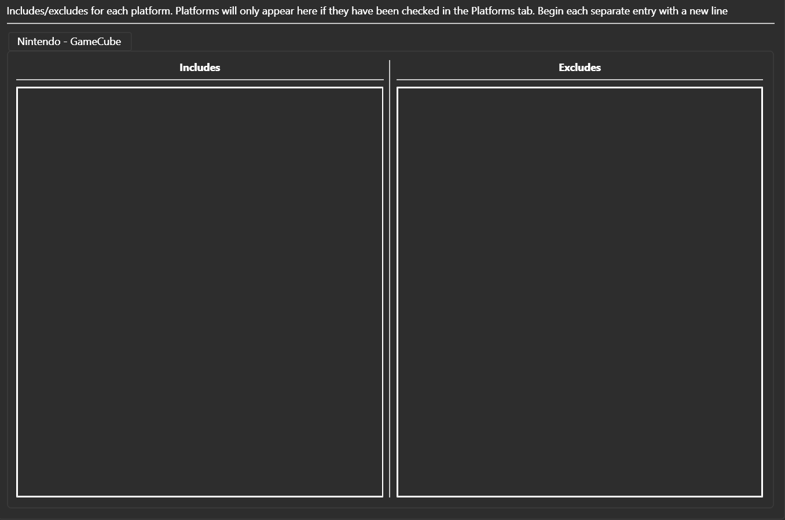

########################
Config includes/excludes
########################

The platforms page of the config tab allows you to set includes and excludes per-platform. Put each term on a new line.
This will match at the beginning of the string, but will search through dupes as well in GameFinder.

