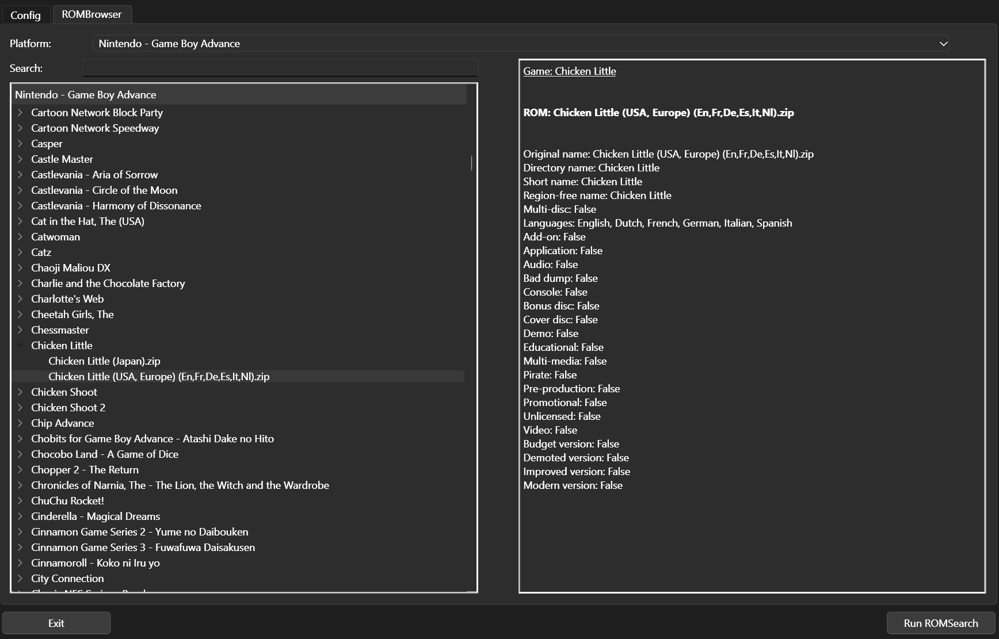

##########
ROMBrowser
##########

The ROMBrowser offers a GUI way to view information about games (e.g. their aliases) and ROMs (certain parsed values).
To get there, click the "ROMBrowser" tab of the GUI, and then select a platform.

The ROMBrowser will be expanded in future releases, but for now exists as a way to see how ROMs are being grouped
together and parsed.
